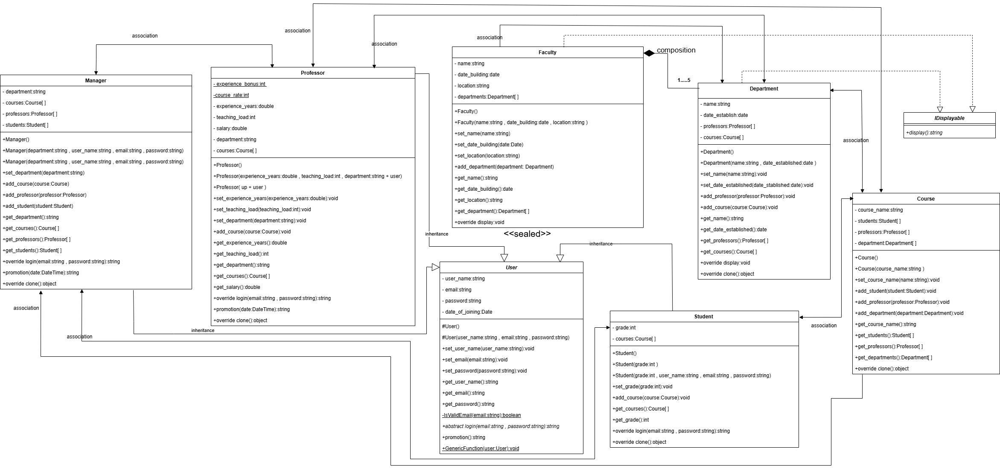

# University Management System
It is a simple console project created to include most of what i have learned about ```Object Oriented Programming ```  using ```C#``` as the programming language.

# UML Diagram    


# OOP Concepts Included 

|Concept               |  Application                                                      |
|:---------------------|:-----------------------------------------------------------------:|
|**Class and Object**    |The `User` class represents a user object with attributes like `user_name`, `email` and methods like `get_email()`|
|**Constructor**         |The `Student` Class includes a special overloaded method for creating and initializing objects , these constructors are `Student()` and `Student(grade,...)`|
|**Static**              |`Professor` class has static consts shared by all objects like `experience_bonus` , `User` class has an independent shared method : `is_valid_email(email)`|
|**Modifiers**           |`Student` class is an `internal` class with `Private` grade attribute and `Public` set_grade(grade) method , and `User` class has `Protected` User() constructors| 
|**Encapsulation**       |`User` class has private field `email` can only be accessed by a public method `set_email()` with a condition before assignment |
|**Abstraction**         |The `User` abstract class defines common attributes and functions (abstract and not abstract) for subclasses `Professor`,`Student`, `Manager`,they implement abstract method `login(user_name,password)`|
|**Inheritance**         |The `Professor` class inherits from the `User` class, reusing common functionality like `get_email()` , adds specialized attributes like `salary` and behaviors like `get_experience_years()` |
|**Polymorphism**        |I create `Professor` object and assign its reference to a `User`reference variable as any professor is a user but not vise versa.(check the main method) |
|**Association**         |`Student take course` is a general relationship represented by `addcourse(course)` function in `Student` and `addstudent(student)` in `Course` class |
|**Composition**         |`Faculty consists of at most 5 Departments` is a whole-part strong ownership relationship represented by `add_department(department)` function in `Faculty` class| 
|**this  keyword**       |In any constructor of class i use it to refer class’s `hidden data fields`. I also refere to a `get_user_name()` defined in `User` from the `Professor`|
|**Dynamic Binding**     |`login(user_name,password)` is a method implemented along the inheritance chain User , Professor ,......when calling that method on professor object it searches for it in `Professor` class if it is not found it raises up until it reachs the `User` class|
|**Constructor Chaining**|`Student(grade,user_name)` parametrized constructor invoke the overloaded constructor `User(user_name,email,....)` before it performs its own task , `Student()` default constructor call the default `User()` constructor |
|**Generic Function**    |`GenericFunction(user)` method in `User` class defines a variable with a supertype `User` , which can accept an object of any subtype ,we make `explicit casting` for the object by the help of `is` operator |
|**Interface**           |`IDisplayable` interface represents a common behavior (Displaying) for related or unrelated classes with method `display()` , `Faculty` class implements it |
|**ICloneable**          |`Manager` class implements the IClonable interface implements `Clone()` method , for `shallow and deep copy` |

```There were examples from the whole project , Check the main method for more explaination```

# Recommendation 
I highly recommend the reference  
**INTRODUCTION TO JAVA PROGRAMMING** ,
chapters: **9,10,11,12,13** for learning **OOP Concepts**. They are very helpful and you can apply using different programming language from Java .


# Installation and Run

1- clone the repo :  
```
git clone https://github.com/alyaaa7med/university-management-system.git
```

2- change your directory to the repo : 
```
cd university-management-system
```
3- run the project :
```
dotnet run
```

# Contribution 
Any contributions will be greatly appreciated.

1. Fork the Repository
2. Create and Switch to your Feature Branch: 
   ```git checkout -b NewFeature```
3. Stage your Changes ```git add -A ```
4. Commit your Changes: ```git commit -m "add some new features"```
5. Push to the Branch: ``` git push origin NewFeature```
6. Open a Pull Request


